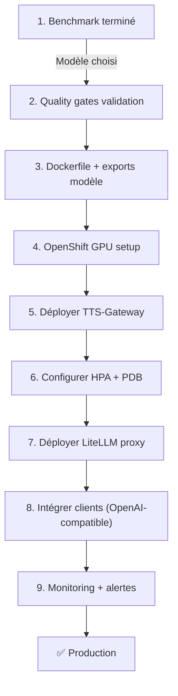

# Guide de Déploiement OpenShift + GPU + LiteLLM

## Vue d'ensemble

Après le benchmark, le flux de déploiement en production comprend :
1. **Choix du modèle** (ex: Chatterbox, XTTS, Higgs)
2. **Configuration OpenShift** pour GPU scalable
3. **Robustesse** (health checks, caching, retry logic)
4. **Intégration LiteLLM** comme reverse proxy
5. **Monitoring & observabilité**

---

## 1. Préparation post-benchmark

### 1.1 Exporter le modèle sélectionné

```bash
# Après benchmark: supposons que Chatterbox est le gagnant
cd /Users/abdelmouise/Documents/projects/stt

# Installer les dépendances du modèle
pip install -e ".[chatterbox]"

# Créer un script de export/cache du modèle
cat > export_model.py << 'EOF'
#!/usr/bin/env python3
import os
from tts_gateway.app.backends.loader import get_backend

# Précharger et cacher le modèle
backend = get_backend("chatterbox", device="cuda")
print(f"✅ Modèle {backend.__class__.__name__} préchargé dans /cache")
EOF

python export_model.py
```

### 1.2 Qualifier votre modèle (7 quality gates - voir README)

Avant déploiement production, valider :
- [ ] Latence < 2s pour texte court (< 50 chars)
- [ ] BLEU/WER score acceptable (voir bench/results.csv)
- [ ] Gestion des langues mixtes
- [ ] Voice cloning stability (si applicable)
- [ ] Memory footprint acceptable (< 20GB VRAM sur A100)
- [ ] No GPU memory leaks after 1000 requests
- [ ] License compliance (MIT vs NC vs CC-BY-NC-SA)

---

## 2. Configuration GPU sur OpenShift

### 2.1 Ajouter le support GPU au cluster

**Prérequis** : OpenShift 4.12+ avec operator NVIDIA GPU

```bash
# Vérifier l'installation
oc get nodes -L nvidia.com/gpu.product

# Si absent, installer l'operator
oc apply -f https://raw.githubusercontent.com/NVIDIA/gpu-operator/master/bundle/openshift/ocp-gpu-operator.yaml
```

### 2.2 Mettre à jour nodeSelector & tolerations

Fichier : [deploy/openshift/deployment.yaml](deploy/openshift/deployment.yaml#L22-L27)

```yaml
spec:
  nodeSelector:
    # ✅ Adapter à votre cluster (A100/H100/T4/etc.)
    nvidia.com/gpu.product: NVIDIA-A100-SXM4-40GB
    
  tolerations:
    - key: nvidia.com/gpu
      operator: Exists
      effect: NoSchedule
```

**Découvrir les GPU disponibles** :
```bash
oc get nodes -o wide
oc describe node <gpu-node> | grep nvidia
```

### 2.3 Ressources GPU optimisées

Fichier : [deploy/openshift/deployment.yaml](deploy/openshift/deployment.yaml#L48-L56)

```yaml
resources:
  requests:
    cpu: "4"                    # 4 cores CPU
    memory: 16Gi                # 16GB RAM
    nvidia.com/gpu: "1"         # 1 GPU
  limits:
    cpu: "8"                    # Max 8 cores
    memory: 32Gi                # Max 32GB
    nvidia.com/gpu: "1"         # 1 GPU max
```

**Tuning par modèle** :

| Modèle | GPU | CPU | RAM | Notes |
|--------|-----|-----|-----|-------|
| Chatterbox (500M) | 1× A100 | 4 | 16Gi | Optimisé |
| XTTS (1B) | 1× A100 | 6 | 20Gi | Heavier |
| Higgs (4B) | 1× A100 | 8 | 24Gi | Plus lourd |
| Fish-Speech (5B) | 2× A100 | 12 | 32Gi | Multi-GPU |

---

## 3. Scalabilité robuste avec HPA (Horizontal Pod Autoscaler)

### 3.1 Configuration HPA améliorée

Fichier : [deploy/openshift/hpa.yaml](deploy/openshift/hpa.yaml)

⚠️ **Limitation** : HPA basé sur CPU seul. Sur GPU, il faut :
- Mesurer CPU + latency
- Utiliser metrics personnalisées

**Configuration améliorée** :

```yaml
apiVersion: autoscaling/v2
kind: HorizontalPodAutoscaler
metadata:
  name: tts-gateway
spec:
  scaleTargetRef:
    apiVersion: apps/v1
    kind: Deployment
    name: tts-gateway
  minReplicas: 2              # ✅ Au moins 2 replicas pour HA
  maxReplicas: 4              # ⚠️ Limiter par nombre de GPU dispo
  
  metrics:
    # 1️⃣ CPU utilization (simple trigger)
    - type: Resource
      resource:
        name: cpu
        target:
          type: Utilization
          averageUtilization: 70
    
    # 2️⃣ Mémoire (fallback)
    - type: Resource
      resource:
        name: memory
        target:
          type: Utilization
          averageUtilization: 80
    
    # 3️⃣ Métrique custom (latency p95)
    - type: Pods
      pods:
        metric:
          name: tts_request_duration_p95_seconds
        target:
          type: AverageValue
          averageValue: "2"    # 2s latency max
  
  behavior:
    scaleDown:
      stabilizationWindowSeconds: 300
      policies:
        - type: Pods
          value: 1
          periodSeconds: 120
    scaleUp:
      stabilizationWindowSeconds: 60
      policies:
        - type: Pods
          value: 2              # ✅ Scale up 2 pods à la fois
          periodSeconds: 30

---
# Pod Disruption Budget: ensure HA
apiVersion: policy/v1
kind: PodDisruptionBudget
metadata:
  name: tts-gateway
spec:
  minAvailable: 1             # ✅ Garder au moins 1 pod actif
  selector:
    matchLabels:
      app: tts-gateway
```

### 3.2 Monitoring GPU pour auto-scaling

Ajouter Prometheus scraper (déjà dans deployment) :

```yaml
annotations:
  prometheus.io/scrape: "true"
  prometheus.io/path: /metrics
  prometheus.io/port: "8000"
```

**Implémenter métriques GPU** dans `src/tts_gateway/app/metrics.py` :

```python
from prometheus_client import Gauge
import torch

gpu_memory_used = Gauge(
    'tts_gpu_memory_used_bytes',
    'GPU memory used',
    ['device_id']
)

gpu_utilization = Gauge(
    'tts_gpu_utilization_percent',
    'GPU utilization',
    ['device_id']
)

def update_gpu_metrics():
    """Exporte les métriques GPU à Prometheus"""
    for i in range(torch.cuda.device_count()):
        props = torch.cuda.get_device_properties(i)
        used = torch.cuda.memory_allocated(i)
        
        gpu_memory_used.labels(device_id=i).set(used)
        # GPU utilization nécessite nvidia-smi ou pynvml
```

---

## 4. Robustesse en production

### 4.1 Health checks améliorés

Fichier : [src/tts_gateway/app/main.py](src/tts_gateway/app/main.py)

```python
@app.get("/healthz")
async def health_check():
    """Liveness: service is running"""
    return {"status": "ok"}

@app.get("/readyz")
async def readiness_check():
    """Readiness: ready to accept traffic"""
    try:
        # Vérifier GPU disponible
        import torch
        if not torch.cuda.is_available():
            return {"status": "not_ready", "reason": "GPU not available"}, 503
        
        # Vérifier modèle chargé
        backend = get_backend()
        test_audio = backend.synthesize("Test", lang="en")
        if not test_audio:
            return {"status": "not_ready"}, 503
        
        return {"status": "ready"}
    except Exception as e:
        return {"status": "not_ready", "error": str(e)}, 503
```

**Probes config** (déjà dans deployment, à ajuster) :

```yaml
startupProbe:
  httpGet:
    path: /readyz
    port: http
  failureThreshold: 60
  periodSeconds: 10              # ✅ 10 min pour charger modèle

readinessProbe:
  httpGet:
    path: /readyz
    port: http
  periodSeconds: 10
  timeoutSeconds: 5
  failureThreshold: 3

livenessProbe:
  httpGet:
    path: /healthz
    port: http
  periodSeconds: 30
  timeoutSeconds: 5
  failureThreshold: 3
```

### 4.2 Circuit Breaker & Retry Logic

Fichier : `src/tts_gateway/app/main.py`

```python
from tenacity import retry, stop_after_attempt, wait_exponential
from circuitbreaker import circuit

@retry(stop=stop_after_attempt(3), wait=wait_exponential(multiplier=1, min=2, max=10))
@circuit(failure_threshold=5, recovery_timeout=60)
async def synthesize_with_retry(text: str, lang: str, voice_id: str):
    """Retry + circuit breaker pour robustesse"""
    try:
        audio = backend.synthesize(text, lang=lang, voice_id=voice_id)
        return audio
    except Exception as e:
        logger.error(f"Synthesis failed: {e}")
        raise
```

### 4.3 Gestion du cache modèle

Fichier : [src/tts_gateway/app/backends/base.py](src/tts_gateway/app/backends/base.py)

```python
class BaseBackend:
    def __init__(self, model_cache_dir: str = "/cache/huggingface"):
        # ✅ Cache persistant sur PVC
        self.model_cache_dir = model_cache_dir
        os.environ["HF_HOME"] = model_cache_dir
        os.environ["TORCH_HOME"] = model_cache_dir
        
        # Précharger le modèle au init (startup)
        self._load_model()
    
    def _load_model(self):
        """Chargé une seule fois au startup pod"""
        logger.info("Preloading model on GPU...")
        # Modèle chargé reste en VRAM
```

**PVC config** (déjà dans deployment) :

```yaml
volumeMounts:
  - name: model-cache
    mountPath: /cache           # Hugging Face models
  - name: voices
    mountPath: /app/voices      # Custom voice profiles

volumes:
  - name: model-cache
    persistentVolumeClaim:
      claimName: tts-model-cache
  - name: voices
    persistentVolumeClaim:
      claimName: tts-voices
```

### 4.4 Request timeout & graceful shutdown

```python
import signal

@app.middleware("http")
async def timeout_middleware(request, call_next):
    """Timeout 30s max par request"""
    try:
        response = await asyncio.wait_for(
            call_next(request),
            timeout=30
        )
        return response
    except asyncio.TimeoutError:
        return JSONResponse({"error": "Request timeout"}, status_code=504)

def signal_handler(signum, frame):
    """Graceful shutdown: finir les requests en vol"""
    logger.info("SIGTERM reçu, shutdown gracieux...")
    # Donner max 30s pour finir les requests
    raise SystemExit(0)

signal.signal(signal.SIGTERM, signal_handler)
```

---

## 5. Intégration LiteLLM

### 5.1 Pourquoi LiteLLM ?

LiteLLM est un **reverse proxy universel** qui normalise les interfaces :
- ✅ Agrège plusieurs backends (TTS, LLM, vision)
- ✅ Fournit une interface OpenAI-compatible
- ✅ Gère load balancing, fallback, retry
- ✅ Monitoring/logging centralisé
- ✅ Rate limiting & auth

### 5.2 Architecture avec LiteLLM

```
Client (banking app)
       ↓
    LiteLLM (proxy + load balancer + auth)
       ↓
    [Pod 1]  [Pod 2]  [Pod 3]  [Pod 4]
   TTS-Gateway sur GPU
```

### 5.3 Déployer LiteLLM

Créer `deploy/openshift/litellm-deployment.yaml` :

```yaml
apiVersion: apps/v1
kind: Deployment
metadata:
  name: litellm-proxy
  labels:
    app: litellm
spec:
  replicas: 2
  selector:
    matchLabels:
      app: litellm
  template:
    metadata:
      labels:
        app: litellm
    spec:
      containers:
        - name: litellm
          image: ghcr.io/berriai/litellm:main
          ports:
            - name: http
              containerPort: 8000
          env:
            - name: LITELLM_MASTER_KEY
              valueFrom:
                secretKeyRef:
                  name: litellm-secrets
                  key: master-key
          volumeMounts:
            - name: config
              mountPath: /app/config.yaml
              subPath: config.yaml
          readinessProbe:
            httpGet:
              path: /health
              port: http
            periodSeconds: 10
      volumes:
        - name: config
          configMap:
            name: litellm-config

---
apiVersion: v1
kind: Service
metadata:
  name: litellm
  labels:
    app: litellm
spec:
  type: ClusterIP
  selector:
    app: litellm
  ports:
    - name: http
      port: 8000
      targetPort: 8000

---
apiVersion: route.openshift.io/v1
kind: Route
metadata:
  name: litellm
spec:
  to:
    kind: Service
    name: litellm
  port:
    targetPort: http
```

### 5.4 Configuration LiteLLM (model_list)

Créer `deploy/openshift/litellm-config.yaml` :

```yaml
apiVersion: v1
kind: ConfigMap
metadata:
  name: litellm-config
data:
  config.yaml: |
    model_list:
      - model_name: tts-gateway
        litellm_params:
          model: openai/tts-gateway
          api_base: http://tts-gateway.default.svc.cluster.local:8000
          api_key: ""  # No auth for internal

    # ✅ Retry & load balancing
    router_settings:
      enable_load_balancing: true
      load_balancing_strategy: least_busy
      retry_policy:
        retries: 3
        retry_delay: 1
      fallback_policy:
        - tts-gateway

    # ✅ Rate limiting per consumer
    rate_limit_config:
      enabled: true
      base_hourly_requests: 100000  # Par API key
      ttl: 3600

    # ✅ Logging
    logging:
      - type: prometheus
        metrics_port: 8001

    # ✅ Auth keys
    keys: []  # Gérer via secrets
```

Créer `deploy/openshift/litellm-secrets.yaml` :

```yaml
apiVersion: v1
kind: Secret
metadata:
  name: litellm-secrets
type: Opaque
stringData:
  master-key: "your-super-secret-key-change-me"  # ⚠️ À changer!
```

### 5.5 Client integration (Python)

```python
from litellm import acompletion

# Appeler via LiteLLM (normalise l'interface)
response = await acompletion(
    model="tts-gateway",
    messages=[
        {
            "role": "user",
            "content": "Bonjour, votre solde est de 1234 euros",
            "lang": "fr",
            "voice_id": "brand_default"
        }
    ],
    api_base="https://litellm-route.openshift.svc",
    api_key="your-api-key"
)

audio = response.choices[0].content  # Fichier WAV
```

### 5.6 OpenAI-compatible endpoint (via LiteLLM)

```bash
# TTS Gateway s'expose comme "OpenAI TTS" via LiteLLM
curl -X POST https://litellm-route/v1/audio/speech \
  -H "Authorization: Bearer $LITELLM_KEY" \
  -H "Content-Type: application/json" \
  -d '{
    "model": "tts-gateway",
    "input": "Bonjour, votre solde est de 1234 euros",
    "voice": "brand_default",
    "language": "fr"
  }' \
  --output audio.wav
```

---

## 6. Workflow complet : du benchmark au prod

### 6.1 Checklist pré-déploiement

- [ ] **Benchmark terminé**, modèle gagnant identifié
- [ ] **Quality gates validés** (7 critères du README)
- [ ] **Dockerfile mis à jour** avec modèle sélectionné + dependencies
- [ ] **PVC créées** pour cache + voices (`oc create pvc ...`)
- [ ] **Secrets créés** (`TTS_ADMIN_API_KEY`, `litellm secrets`)
- [ ] **Tests end-to-end** passent sur le cluster
- [ ] **Monitoring configuré** (Prometheus + Grafana)
- [ ] **DR plan** (backup models, hot standby)

### 6.2 Build & push Docker

```bash
# Adapter le Dockerfile pour prod
cat > Dockerfile.prod << 'EOF'
FROM nvidia/cuda:12.2-runtime-ubi9

WORKDIR /app
COPY . .

RUN pip install -e ".[chatterbox]"  # ✅ Modèle sélectionné

EXPOSE 8000
CMD ["uvicorn", "tts_gateway.app.main:app", "--host", "0.0.0.0"]
EOF

# Build & push
buildah build -f Dockerfile.prod -t quay.io/myorg/tts-gateway:1.0.0
podman push quay.io/myorg/tts-gateway:1.0.0
```

### 6.3 Déploiement OpenShift

```bash
# Créer namespace
oc create namespace voice-gateway

# Créer PVCs
oc -n voice-gateway apply -f deploy/openshift/pvc.yaml

# Créer secrets
oc -n voice-gateway create secret generic tts-gateway-secrets \
  --from-literal=admin-api-key="$(openssl rand -hex 32)"
oc -n voice-gateway create secret generic litellm-secrets \
  --from-literal=master-key="$(openssl rand -hex 32)"

# Appliquer toute la stack
oc -n voice-gateway apply -k deploy/openshift/

# Vérifier déploiement
oc -n voice-gateway rollout status deployment/tts-gateway
oc -n voice-gateway get pods -o wide
```

### 6.4 Test smoke

```bash
# Port-forward vers le service
oc -n voice-gateway port-forward svc/tts-gateway 8000:8000

# Test endpoint
curl -X POST http://localhost:8000/v1/synthesize \
  -H "Content-Type: application/json" \
  -H "X-API-Key: $TTS_ADMIN_API_KEY" \
  -d '{
    "text": "Bonjour test",
    "lang": "fr",
    "voice_id": "brand_default"
  }' \
  --output test.wav

file test.wav  # Vérifier WAV valide
```

---

## 7. Monitoring & observabilité

### 7.1 Prometheus scraper (déjà configuré)

Les pods exposent `/metrics` sur port 8000 :

```bash
oc -n voice-gateway port-forward svc/tts-gateway 8000:8000
curl http://localhost:8000/metrics | grep tts_
```

**Métriques clés** :
- `tts_request_duration_seconds` → latency
- `tts_synthesize_errors_total` → error rate
- `tts_gpu_memory_used_bytes` → GPU memory
- `tts_model_inference_time_seconds` → perf per model

### 7.2 Alertes Prometheus

Créer `deploy/openshift/prometheusrule.yaml` :

```yaml
apiVersion: monitoring.coreos.com/v1
kind: PrometheusRule
metadata:
  name: tts-gateway-alerts
spec:
  groups:
    - name: tts-gateway
      interval: 30s
      rules:
        # ⚠️ High error rate
        - alert: TTSGatewayHighErrorRate
          expr: rate(tts_synthesize_errors_total[5m]) > 0.05
          for: 5m
          annotations:
            summary: "TTS error rate > 5%"

        # ⚠️ Latency degradation
        - alert: TTSGatewayHighLatency
          expr: histogram_quantile(0.95, tts_request_duration_seconds) > 3
          for: 5m
          annotations:
            summary: "TTS p95 latency > 3s"

        # ⚠️ GPU memory leak
        - alert: TTSGatewayGPUMemoryLeak
          expr: |
            increase(tts_gpu_memory_used_bytes[1h]) > 
            (1024*1024*1024)  # 1GB
          for: 30m
          annotations:
            summary: "GPU memory increasing > 1GB/hour"
```

### 7.3 Grafana dashboard

Importer des dashboards communautaires :
- Kubernetes cluster monitoring
- GPU monitoring (nvidia-smi metrics)
- FastAPI application metrics

---

## 8. Disaster Recovery & Scaling avancé

### 8.1 Multi-région / Multi-cluster

```yaml
# GitOps avec ArgoCD pour sync multi-cluster
apiVersion: argoproj.io/v1alpha1
kind: Application
metadata:
  name: tts-gateway
spec:
  project: default
  source:
    repoURL: https://github.com/myorg/tts-gateway
    targetRevision: main
    path: deploy/openshift
  destination:
    server: https://kubernetes.default.svc
    namespace: voice-gateway
  syncPolicy:
    automated:
      prune: true
      selfHeal: true
```

### 8.2 Affinity & topology

```yaml
# Spread replicas across nodes pour HA
affinity:
  podAntiAffinity:
    preferredDuringSchedulingIgnoredDuringExecution:
      - weight: 100
        podAffinityTerm:
          labelSelector:
            matchExpressions:
              - key: app
                operator: In
                values:
                  - tts-gateway
          topologyKey: kubernetes.io/hostname
```

### 8.3 Backup strategy

```bash
# Sauvegarder model cache quotidiennement
oc -n voice-gateway exec deployment/tts-gateway -- \
  tar czf /tmp/model-cache.tar.gz /cache

oc -n voice-gateway cp \
  deployment/tts-gateway:/tmp/model-cache.tar.gz \
  ./backup/model-cache-$(date +%Y%m%d).tar.gz
```

---

## 9. Coûts & optimisation

### 9.1 GPU choices par use case

| Cas d'usage | GPU recommandé | Replicas | Coût/mois |
|---|---|---|---|
| **POC/test** | 1× T4 | 1 | ~$35 |
| **Prod faible trafic** | 1× A100 | 2 | ~$500 |
| **Prod haute dispo** | 2× A100 | 4 | ~$1000+ |
| **Failover multi-région** | 1× A100 par région | 2×3 | ~$1500+ |

### 9.2 Cost optimization

- ✅ Spot instances (interruption risk faible pour TTS)
- ✅ Pod priority classes (TTS vs autres workloads)
- ✅ Request coalescence (batch small requests)
- ✅ Model caching (ne pas redownload)

---

## 10. Troubleshooting

### Problème : Pod ne démarre pas (GPU not found)

```bash
# Vérifier GPU nodes
oc get nodes -o wide
oc describe node <gpu-node>

# Vérifier NVIDIA operator
oc get pods -n nvidia-gpu-operator
oc logs -n nvidia-gpu-operator nvidia-driver-daemonset-<pod>
```

### Problème : Latency élevée

```bash
# Analyser les logs
oc logs -f deployment/tts-gateway
oc top pod -n voice-gateway

# Vérifier GPU utilization
oc exec deployment/tts-gateway -- nvidia-smi
```

### Problème : Memory leak

```bash
# Profiler la mémoire
oc exec deployment/tts-gateway -- python -m memory_profiler \
  tts_gateway.app.main
```

---

## Résumé : Étapes d'action



---

**Prochaines étapes** :
1. Affiner le modèle sélectionné post-benchmark
2. Adapter `deploy/openshift/deployment.yaml` à votre GPU (A100 vs T4)
3. Créer les PVCs pour cache persistant
4. Ajouter la stack LiteLLM + intégration clients
5. Tester HPA avec load testing
